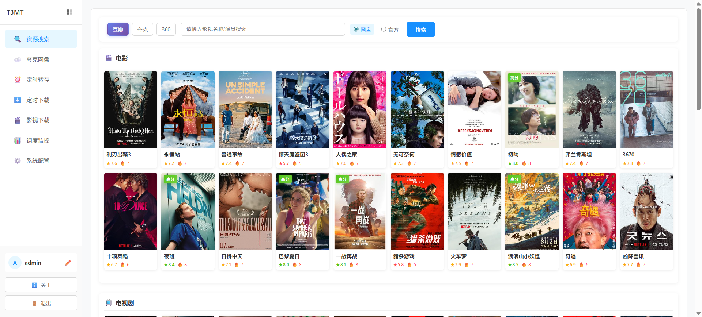
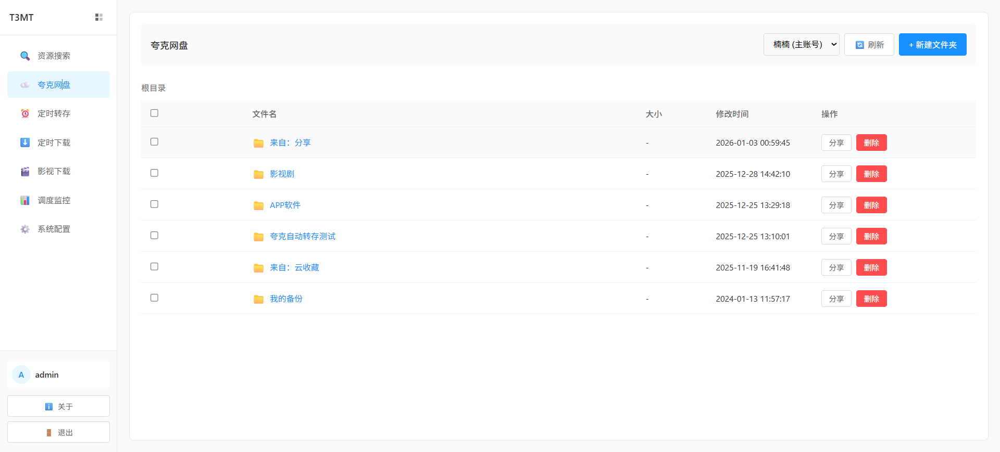
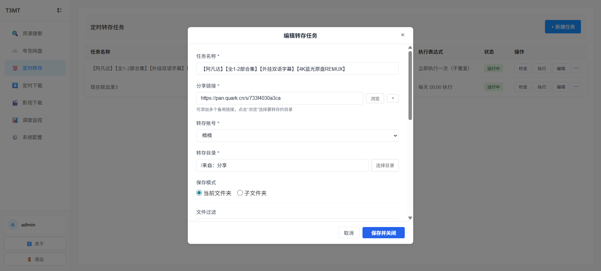
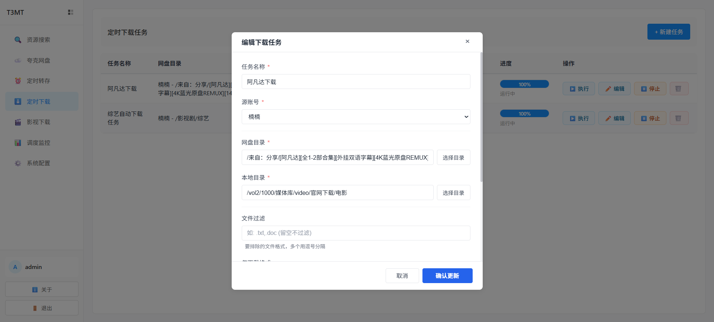
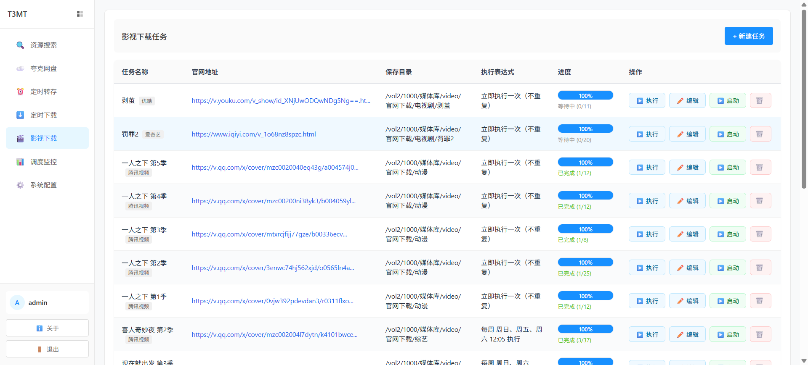
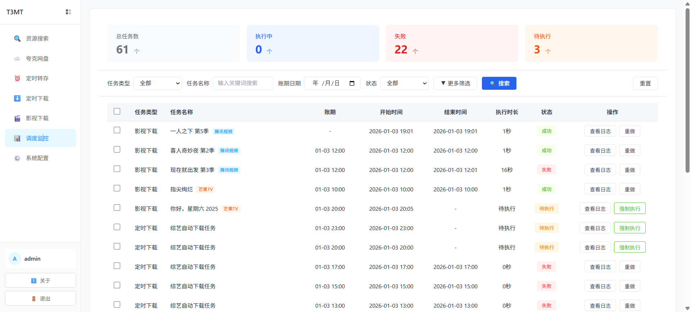
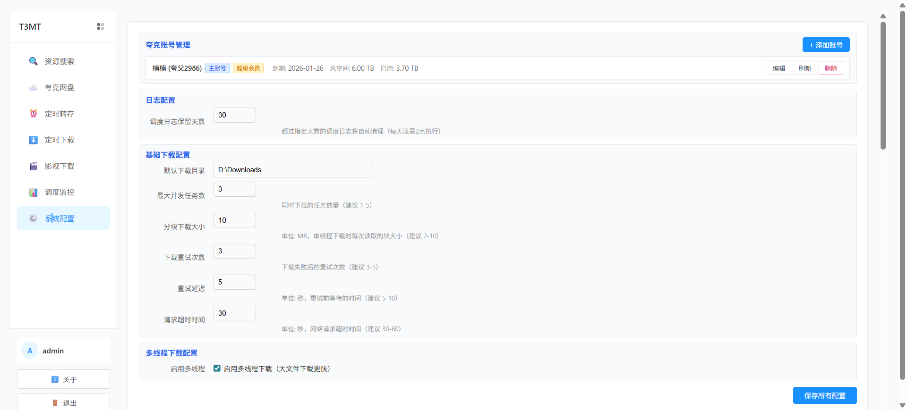

# T3MT

一个功能强大的影视资源管理工具，支持影视解析下载、资源搜索、定时转存、自动更新、夸克资源转存、自动下载等功能。

## 界面预览

### 资源搜索


### 影视排行榜


### 网盘管理


### 定时转存


### 影视下载


### 定时下载


### 系统配置


## 项目特点

- **功能丰富**：影视下载、资源搜索、定时任务、自动更新
- **轻量化**：采用 Python + Flask + SQLite 技术栈，无需复杂配置
- **简单化**：原生 HTML/JS 前端，无需构建工具
- **容器化**：支持 Docker 部署，开箱即用

## 核心功能

### 🎬 影视管理
- **多平台支持**：芒果TV、爱奇艺、腾讯视频、优酷等主流平台
- **智能解析**：自动解析视频链接，获取视频信息
- **选集下载**：支持单集、多集、全集下载
- **定时追剧**：设置定时任务，自动下载更新的剧集
- **断点续传**：支持下载中断后继续下载
- **多线程下载**：提高下载速度

### 🔍 资源搜索
- **全网搜索**：集成盘搜 API，搜索海量网盘资源
- **分类筛选**：按类型、大小、时间等条件筛选
- **链接检测**：自动检测分享链接有效性
- **一键转存**：搜索结果一键转存到网盘

### 📥 资源下载
- **定时下载**：设置定时任务，自动下载网盘资源到本地
- **增量下载**：只下载新增文件，避免重复下载
- **文件过滤**：支持按扩展名、大小等条件过滤
- **目录结构**：保持原有目录结构或自定义
- **并发控制**：控制同时下载任务数

### 🔄 定时更新
- **自动转存**：定时从分享链接转存资源
- **多链接备份**：支持多个分享链接作为备份源
- **规则处理**：自定义文件过滤和处理规则
- **Cron 表达式**：灵活的定时任务配置
- **执行日志**：详细的任务执行记录

### 📊 任务管理
- **任务监控**：实时查看任务执行状态
- **进度跟踪**：显示下载进度和剩余时间
- **日志查询**：多条件筛选任务日志
- **自动清理**：定期清理过期日志

### ⚙️ 系统配置
- **账号管理**：支持多账号管理
- **下载配置**：自定义下载目录、并发数等
- **API 配置**：配置盘搜 API 地址
- **系统设置**：日志保留、邮件提醒等

## 技术栈

### 后端
- Python 3.9
- Flask 3.0
- SQLite 3
- APScheduler 3.10

### 前端
- 原生 HTML5
- 原生 CSS3
- 原生 JavaScript (ES6+)

## 快速部署

### 方式一：Docker Compose 部署（推荐）

1. 创建 `docker-compose.yml` 文件：

```yaml
version: '3.8'

services:
  t3mt:
    image: 85423296/t3mt:latest
    container_name: t3mt
    restart: unless-stopped
    ports:
      - "8520:80"
    volumes:
      - ./data:/app/backend/data           # 数据库文件
      - ./logs:/app/backend/logs           # 日志文件
      - ./downloads:/app/backend/downloads # 下载目录
    environment:
      - TZ=Asia/Shanghai
```

2. 启动服务：

```bash
docker-compose up -d
```

3. 访问系统：

打开浏览器访问：`http://your-server-ip:8520`

默认账号：`admin`  
默认密码：`admin123`

### 方式二：本地开发部署

#### 1. 环境要求

- Python 3.8+
- pip 包管理器
- 现代浏览器

#### 2. 安装依赖

```bash
# 进入后端目录
cd backend

# 创建虚拟环境（推荐）
python -m venv venv

# 激活虚拟环境
# Windows:
venv\Scripts\activate
# Linux/Mac:
source venv/bin/activate

# 安装依赖
pip install -r requirements.txt
```

#### 3. 启动服务

```bash
# 启动后端服务
python start.py
```

服务启动后访问：`http://localhost:8520`

## 使用指南

### 1. 影视下载

#### 基本使用
1. 进入"影视下载"页面
2. 粘贴视频链接（支持芒果TV、爱奇艺、腾讯视频、优酷）
3. 系统自动解析视频信息
4. 选择要下载的集数
5. 设置下载目录
6. 点击"立即下载"或"定时下载"

#### 定时追剧
1. 创建影视下载任务
2. 设置 Cron 表达式（如：`0 2 * * *` 每天凌晨2点）
3. 系统自动检测更新并下载新剧集

### 2. 资源搜索

1. 进入"资源搜索"页面
2. 输入关键词搜索
3. 使用筛选条件精确查找
4. 点击"转存"按钮保存资源

### 3. 定时转存

1. 进入"定时转存"页面
2. 点击"新建任务"
3. 填写任务名称和分享链接
4. 选择目标账号和保存路径
5. 设置文件过滤规则（可选）
6. 配置 Cron 表达式
7. 保存任务

### 4. 定时下载

1. 进入"定时下载"页面
2. 点击"新建任务"
3. 选择源账号和网盘目录
4. 设置本地下载目录
5. 配置文件过滤和下载选项
6. 设置 Cron 表达式
7. 保存任务

### 5. 账号配置

1. 进入"系统配置"页面
2. 点击"添加账号"
3. 填写账号备注和 Cookie
4. 点击"测试并保存"

**获取 Cookie 方法**：
1. 打开浏览器开发者工具（F12）
2. 访问网盘并登录
3. 在 Network 标签中找到请求
4. 复制 Cookie 值

## 项目结构

```
├── backend/                # 后端代码
│   ├── api/               # API 接口层
│   │   ├── video.py       # 影视下载接口
│   │   ├── search.py      # 资源搜索接口
│   │   ├── transfer.py    # 转存任务接口
│   │   ├── download.py    # 下载任务接口
│   │   └── ...
│   ├── services/          # 业务逻辑层
│   │   ├── video_parser/  # 视频解析服务
│   │   ├── download_service.py # 下载服务
│   │   └── ...
│   ├── tasks/             # 任务调度层
│   ├── utils/             # 工具类
│   ├── config/            # 配置目录
│   ├── app.py             # 应用入口
│   ├── config.py          # 配置文件
│   ├── config.ini         # 基础配置
│   └── start.py           # 启动脚本
├── frontend/              # 前端代码
│   ├── pages/             # 功能页面
│   │   ├── video.html     # 影视下载页面
│   │   ├── search.html    # 资源搜索页面
│   │   ├── transfer.html  # 定时转存页面
│   │   └── download.html  # 定时下载页面
│   ├── index.html         # 主框架
│   └── login.html         # 登录页面
├── Dockerfile             # Docker 构建文件
├── docker-compose.yml     # Docker Compose 配置
└── README.md              # 项目说明
```

## 配置说明

### 基础配置（backend/config.ini）

```ini
[app]
# 应用基本配置
host = 0.0.0.0
port = 8520
debug = false
```

### 系统配置

在"系统配置"页面可以配置：
- 下载默认目录
- 最大并发下载数
- 下载速度限制
- 分块下载大小
- 下载重试次数
- 日志保留天数

## Docker 部署详解

### 构建自定义镜像

```bash
# 构建镜像
docker build -t t3mt:custom .

# 运行容器
docker run -d \
  --name t3mt \
  -p 8520:80 \
  -v $(pwd)/data:/app/backend/data \
  -v $(pwd)/logs:/app/backend/logs \
  -v $(pwd)/downloads:/app/backend/downloads \
  -e TZ=Asia/Shanghai \
  t3mt:custom
```

### 查看日志

```bash
# 查看容器日志
docker-compose logs -f

# 查看应用日志
docker-compose exec t3mt cat /var/log/supervisor/flask.log
```

### 更新镜像

```bash
# 拉取最新镜像
docker-compose pull

# 重启服务
docker-compose down
docker-compose up -d
```

## 常见问题

### 1. 视频解析失败

- 检查视频链接是否正确
- 确认平台是否支持
- 查看错误日志获取详细信息

### 2. 下载速度慢

- 调整并发下载线程数
- 检查网络连接
- 增加分块下载大小

### 3. 任务不执行

- 检查任务状态是否为"运行中"
- 验证 Cron 表达式是否正确
- 查看任务执行日志

### 4. Cookie 失效

- 重新获取 Cookie 并更新账号配置
- 检查账号是否正常登录

### 5. 磁盘空间不足

- 清理下载目录
- 调整下载任务数量
- 启用自动清理功能

### 6. Docker 容器无法启动

```bash
# 查看详细错误日志
docker-compose logs --tail=100

# 检查端口占用
netstat -an | grep 8520
```

## 开发说明

### 本地开发

1. 启动后端服务（端口 8520）
2. 直接打开 `frontend/login.html`
3. 修改代码后重启服务

### 调试技巧

1. 查看后端日志：`backend/logs/app_YYYYMMDD.log`
2. 查看浏览器控制台
3. 使用开发者工具调试网络请求

### 添加新平台支持

1. 在 `services/video_parser/` 添加解析器
2. 在 `api/video.py` 注册新平台
3. 更新前端平台选择列表

## 注意事项

1. 请遵守视频平台的使用条款
2. 下载的视频仅供个人学习使用
3. 定期备份数据库文件（data 目录）
4. 合理设置任务执行频率，避免频繁请求
5. 注意磁盘空间使用
6. 生产环境建议使用 HTTPS
7. Cookie 包含敏感信息，请妥善保管

## 更新日志

查看 [UPDATE_LOG.md](../UPDATE_LOG.md) 了解版本更新历史

## 许可证

MIT License

## 贡献

欢迎提交 Issue 和 Pull Request

## 联系方式

如有问题请提交 Issue
